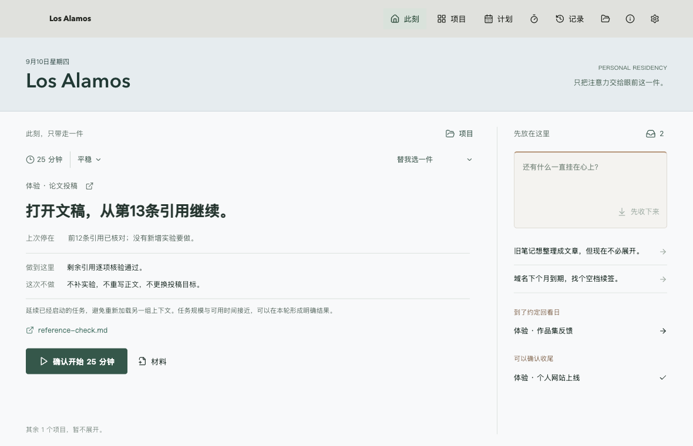

# Los Alamos

> 不用先把自己管理好，也能开始。

[](https://github.com/ASTion24/los-alamos/releases)
[](https://github.com/ASTion24/los-alamos/actions/workflows/ci.yml)


Los Alamos 是一个用于关闭长尾项目的本地桌面工作区。

它面对的不是“没有计划”，而是另一种更常见的困境：工作已经完成了
70% 到 90%，剩余部分却长期悬置；每次回来都要重新理解上下文，最后连
“什么时候认真收尾”也变成一件未完成的事。

Los Alamos 把这段负担压缩成一个可以立刻进入的动作，并在离开时替你保管
下一次所需的上下文。它不替你完成真实工作，也不把生活改造成待办清单。



## 此刻，只带走一件

默认首页不再要求先建模、分类或配置一套系统。主路径只有三个动作：

1. **先收下**：用一句原话保存挂念。它暂时不是任务，不增加进度，也不要求承诺日期。
2. **只带走一件**：首页展示本轮具体动作、完成标准、不做边界和材料入口；确认后才开始计时。
3. **留好下次入口**：结束时默认只记录“停在哪里”和“下次做什么”。回来后直接从这个入口继续。

当最后一个动作完成，可以当场确认项目收尾。关闭需要证据；暂存需要回看日期；
等待需要明确外部条件。Los Alamos 不用“100%”掩盖仍未解决的状态。

## 为什么不是另一款待办工具

- **收纳不等于承诺**：想到的事可以先离开大脑，不必立刻变成项目。
- **边界先于执行**：开始动作、完成标准和明确不做在计时前可见。
- **时间不制造进度**：部分完成和检查点不会因为工作了若干分钟而自动涨百分比。
- **中断不会吞掉上下文**：暂停、退出、休眠和异常中断都保留最后确认的活动时间。
- **多日计划是可选容器**：日期、容量和强度可以约束 Residency，但不会成为开始工作的前置手续。
- **事实先于模型**：用户自述的“已完成 80%”与任务图计算进度分开保存。
- **本地规则始终可用**：不配置 API 也能工作；LLM 失败时自动回退，不阻断主路径。

## 快速开始

要求 Node.js `20.19.0` 或更高版本。

```bash
git clone https://github.com/ASTion24/los-alamos.git
cd los-alamos
npm ci
npm run dev
```

运行测试和生产构建：

```bash
npm test
npm run build
```

当前平台的本地安装包：

```bash
npm run dist
```

发布页提供 CI 构建的 macOS、Windows 和 Linux 预览包。未签名或未公证的包可能触发
系统安全提示；正式 macOS 签名流程见
[`docs/macos-signing.md`](docs/macos-signing.md)。

## 两条路径，一个工作区

### 原生应用

桌面应用提供：

- “此刻”入口、挂念收纳箱与明确确认后的一键开始；
- 项目交接、任务依赖图、历史和可选的多日驻留计划；
- 暂停、恢复、检查点、两项快速交接与正式收尾；
- 经用户点击后打开已记录材料；脚本和未知类型只定位，不执行；
- OpenAI-compatible API 主机、模型与密钥配置，本地规则自动兜底。

数据默认位于系统“文稿/Documents”目录下的 `Los Alamos/`。API 密钥通过
Electron `safeStorage` 保存；Linux 桌面应启用 Secret Service 或 KWallet。

### Agent workspace

同一工作区可以直接交给 Codex、Claude Code、TRAE 或其他 Coding Agent。唯一入口是：

```bash
./.los/los agent context --json
```

能力发现：

```bash
./.los/los agent capabilities --json
```

Windows 使用 `.los\los.cmd`。启动器不依赖 npm；缺少系统 Node 时会复用
Los Alamos 桌面 Runtime。Agent 与 GUI 共享事实、任务模型、事件和会话记录，
但开始、恢复、完成和项目终态仍需用户明确确认。

## 公共数据协议

```text
Los Alamos/
  README.md
  AGENTS.md
  .los/
  .trae/skills/los-alamos-residency/SKILL.md
  skills/los-alamos-residency/SKILL.md
  residency.json
  schemas/
  projects/<project-id>/brief.md
  projects/<project-id>/model.json
  projects/<project-id>/events.jsonl
  sessions/<session-id>.json
  plans/<plan-id>.json
  plans/events.jsonl
  inbox/<capture-id>.json
  inbox/events.jsonl
```

`brief.md` 保存用户提供的事实；模型、交接、会话和计划遵守 JSON Schema。
事件日志只追加，不重写。结构化字段保留 `schemaVersion`、`revision`、
`updatedAt` 和 `updatedBy`，旧数据通过可选字段兼容。

## 架构

```text
apps/desktop/        Electron 主进程、preload 与 React 界面
packages/core/       任务图、调度、进度和会话纯逻辑
packages/workspace/  本地持久化、校验、锁与协议同步
packages/cli/        CLI 与 Agent 状态机
packages/llm/        OpenAI-compatible 模型适配
schemas/             公共 JSON 合约
skills/              Agent 工作流协议
```

Electron 渲染器启用 `sandbox` 与 `contextIsolation`。公开写操作通过跨进程工作区锁
串行化，单文件写入使用临时文件替换；这不被表述为数据库级多文件事务。

## 验证

`v0.2.0` 包含 79 项核心、工作区、CLI 与模型适配测试。真实 Electron 验收覆盖
`1180×760` 和最小窗口 `980×640`，包括：

- 收纳、准备、一键开始、分心捕获和草稿恢复；
- 暂停/恢复、两项交接、精确重入与显式收尾；
- 任务图、计划生命周期、Agent Runtime 与 GUI 指令；
- 长文本布局、弹层焦点、并发开始和过期预览 token。

详细证据与复现步骤：

- [此刻工作台验收方案](docs/launcher-acceptance.md)
- [连续驻留验收方案](docs/continuity-acceptance.md)
- [安全策略](SECURITY.md)
- [更新日志](CHANGELOG.md)

## 隐私与边界

Los Alamos 默认不上传项目数据，不扫描材料内容，不监视桌面，不强制屏蔽软件，
也不会未经确认执行文件或替用户完成项目。配置外部模型时，只有相应分析请求会发送到
用户指定的 API 服务。

源码仓库不会提交本地 `workspace/`、`artifacts/`、`release/`、API 密钥或个人项目数据。
